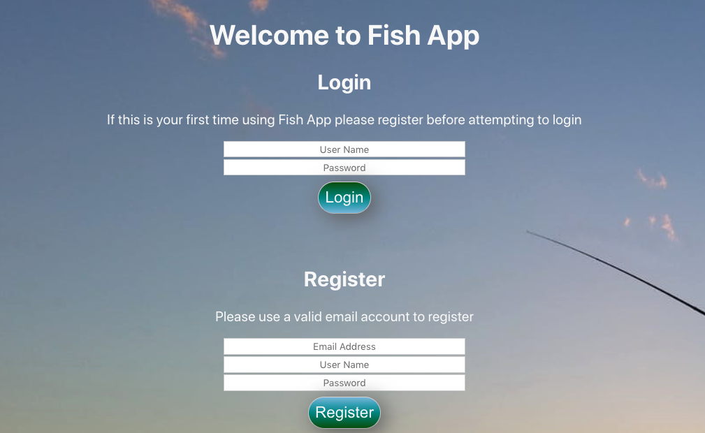
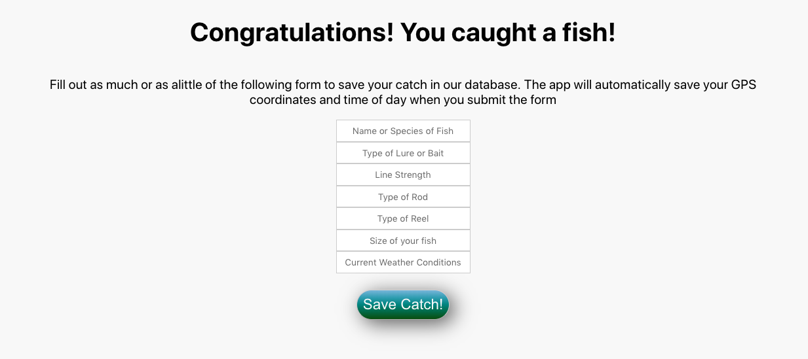
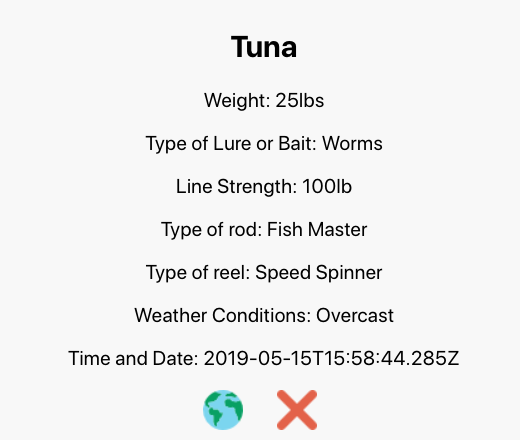
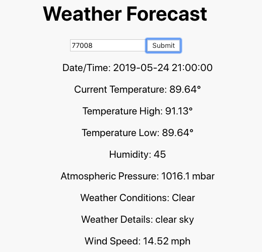
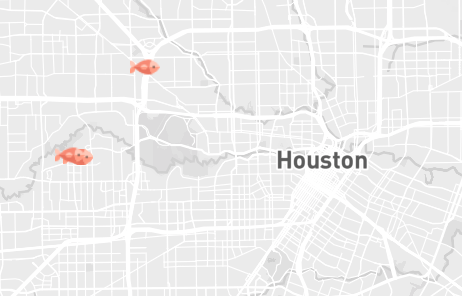

# Fishing Journal

This application is a React/Redux project designed to help fisherman track their catches using geolocation data. It also calls a Weather API to give a three day forecast so you can better plan your fishing trip!

<a href="https://fishing-journal.herokuapp.com/">Live Link</a>

# Login/Credentials

Username: Admin

Password: 123

# Features
HTML, CSS, JavaScript, React.js, Redux, Node,js, Express, Sequelize, Uber's React Map

# How It Works
**Login**

The user is prompted to either login or register. Newly registered users are saved in the database and will then be able to login and access the other components. The state is destroyed when you navigate away from the page, logout or refresh the application. Passwords are encrypted and securely stored in our database using Bcrypt.

**Add Fish**

Here the user is able to save information related to their catch such as type of fish, size, bait/lure used, line strength etc... This data is then saved to the database with an association to the user.

 
**Previous Fish**

 On this component the user can see a list of all their previous catches including the geolocation data and time of catch. Clicking on the globe icon will open a new tab that shows the exact coordinates of your catch including a satellite image. The red X icon will delete that catch from your Previous Fish list.

**Weather**

The Weather component calls an API using your zipcode to give you a three day forecast of weather conditions that might affect your fishing trip.

**Map**

This map component uses Uber's React Map in order to display all of your catches on an interactive map. Zoom, scroll and traverse the globe as you see a visual representation of your hardwork!

**Mobile Responsiveness**

It's safe to assume most fisherman won't be bringing their laptops on their excursions so this application would be best suited for a mobile device, however, responsiveness is not perfect in this iteration. I would most likely rewrite the application using React Native if I revisit this project.

